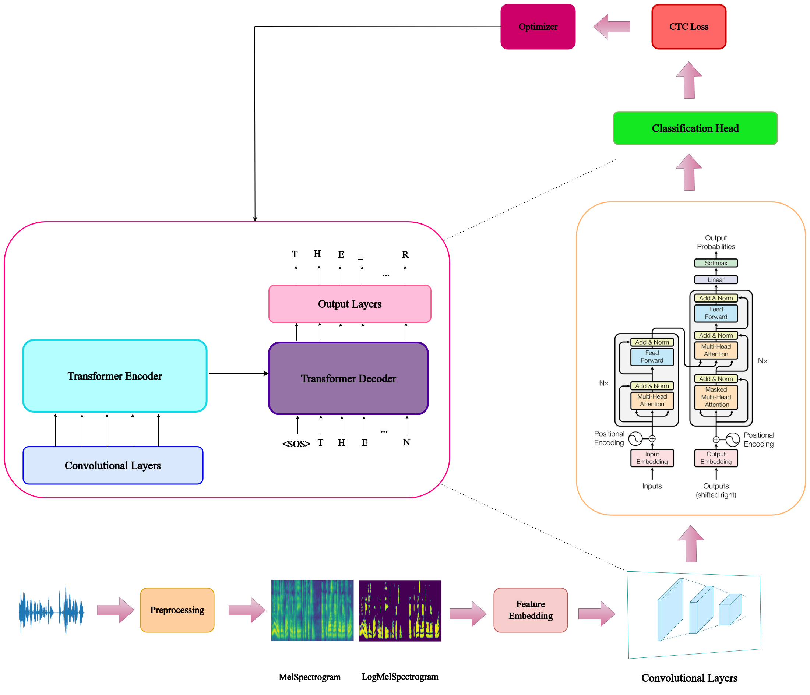

    <video src="./assets/cover.mp4" alt="Logo" width="" height="200">
    </video>
<h1 align="center">Speech Recognition</h1>

## 1. Problem Statement

Speech Recognition is the task of converting spoken language into text, playing a pivotal role in audio processing, by enabling machines to comprehend and interpret human speech. This technology is integrated into various aspects of our daily lives, including voice-controlled interfaces, transcription services for meetings and interviews, hands-free operation of devices, and enhanced accessibility for individuals with disabilities. Popular speech-to-text voice assistants like Siri, Alexa, Google's Assistant, and Microsoft's Cortana demonstrate the capability to interpret human speech and respond in a synthesized voice.

 

          <video width="320" height="240" controls>
             <source src="./assets/LJ-audio.mp4" controls preload="metadata">
           </video>
          
The Middle Ages brought calligraphy to perfection, and it was natural therefore

        

As show in example, an ASR (Automatic Speech Recognition) system is responsible for taking an audio input of someone speaking and returning the text equivalent.

The challenges of a robust speech recognition system, accounting for factors like background noise, varied accents, gender, age, emotion, and health. The primary aim of this project is to utilize deep learning  models for converting spoken words in audio recording into text.

## 2. Related Works
| Date 	| Paper                                                                                                                                                                                                                                                                                                                                                                                                                                                                                                                	| Code                                                                              	|
|------	|----------------------------------------------------------------------------------------------------------------------------------------------------------------------------------------------------------------------------------------------------------------------------------------------------------------------------------------------------------------------------------------------------------------------------------------------------------------------------------------------------------------------	|-----------------------------------------------------------------------------------	|
| 2017 	| [Attention Is All You Need](https://arxiv.org/abs/1706.03762v7) The paper introduces a architecture called Transformer. It is an architecture for transforming one sequence into another one with the help of two parts (Encoder and Decoder). Transformer uses the attention-mechanism. The attention-mechanism looks at an input sequence and decides at each step which other parts of the sequence are important                                                                                       	| [Link](https://github.com/huggingface/transformers)                               	|
| 2020 	| [Conformer: Convolution-augmented Transformer for Speech Recognition](https://arxiv.org/abs/2005.08100) The paper proposes the convolution-augmented transformer for speech recognition, named Conformer. Transformer models are good at capturing content-based global interactions, while CNNs exploit local features effectively. In this work, they combine convolution neural networks and transformers to model both local and global dependencies of an audio sequence in a parameter-efficient way. 	| [Link](https://pytorch.org/audio/main/generated/torchaudio.models.Conformer.html) 	|
| 2020 	| [wav2vec 2.0: A Framework for Self-Supervised Learning of Speech Representations](https://arxiv.org/pdf/2006.11477v3.pdf) Wav2Vec 2.0 uses a self-supervised training approach for Automatic Speech Recognition, which is based on the idea of contrastive learning. It learns speech representations on unlabeled data.                                                                                                                                                                                       	| [Link](https://github.com/facebookresearch/fairseq)                               	|
| 2022 	| [Robust Speech Recognition via Large-Scale Weak Supervision](https://arxiv.org/pdf/2212.04356.pdf) Whisper is a general-purpose speech recognition model. It is trained on a large dataset of diverse audio and is also a multitasking model that can perform multilingual speech recognition, speech translation, and language identification.                                                                                                                                                                	| [Link](https://github.com/openai/whisper)                                         	|

## 3. The Proposed Method

In this project, a transformer model is employed for a speech-to-text task. Initially, a log mel spectrogram is utilized to capture both time and frequency information from the raw input—a single-channel sequence of 16-bit PCM WAV with a sample rate of 22050 Hz representing the audio waveform.

 

For feature embedding, a three-layer Conv2d module is set up to perform extraction on the log-mel spectrogram. These convolutional layers execute local operations, capturing patterns and reducing input feature dimensionality.

 

The transformer architecture is then implemented with both an encoder and a decoder. The encoder processes the input sequence (log mel spectrograms), employing multiple layers of self-attention and feedforward mechanisms to produce a context vector summarizing the input. The decoder generates the output sequence (predicted text) based on this context vector and has its own self-attention and feedforward layers to capture dependencies within the output sequence.

 

The connection between the encoder and decoder involves using the output from the encoder as the initial hidden state for the decoder. Attention mechanisms in both the encoder and decoder enable the model to focus on different parts of the input sequence during the generation of each segment of the output sequence.

 
At last, incorprated classification head to map the transformer's output to the target classes.

## 4. Implementation

### 4.1. Dataset
[The LJ Speech Dataset](https://keithito.com/LJ-Speech-Dataset/)

LJSpeech dataset consisting of 13,100 short audio clips of a single speaker reading passages from 7 non-fiction books. A transcription is provided for each clip. Clips vary in length from 1 to 10 seconds and have a total length of approximately 24 hours.

The transcriptions and audio are in English.

**Files:**

**metadata.csv:**

*   **ID:** this is the name of the corresponding .wav file
*   **Transcription:** words spoken by the reader (UTF-8)
*   **Normalized Transcription:** transcription with numbers, ordinals, and monetary units expanded into full words (UTF-8).

Split the dataset to training, validation, and testing sets based on provided text files.
* **train.txt** - name of the corresponding .wav file for training objects.
* **valid.txt** - name of the corresponding .wav file for validation objects.
* **text.txt** - name of the corresponding .wav file for test objects.

### 4.2. Model
 
  

      
    </a>
  

 

* Step 1: Converting waveforms to Log MelSpectrograms

* Step 2: Feature embedding using Conv2D layers

* Step 3: the Transformer encoder-decoder

* step 4: the Classification head

* step 5: Calculate CTC Loss

* step 6: Optimization

### 4.3. Configurations

### 4.4. Train

### 4.5. Evaluate

